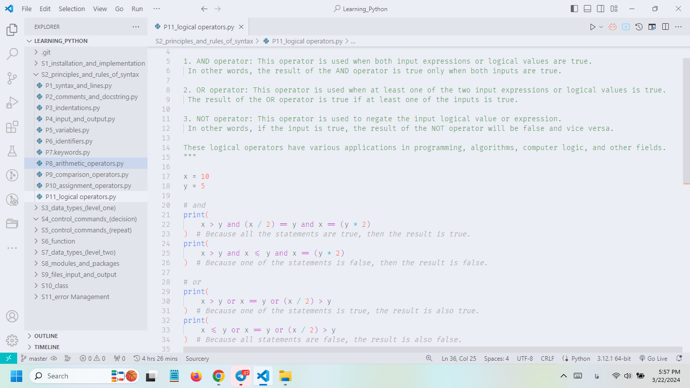
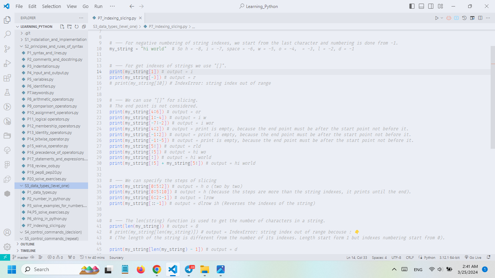

# Learning Python 😍

Hey there, coders, newbies, and everyone who’s heard of Python and thought it was just a snake! Welcome to an all-inclusive Python course that takes you from the basics to the wildest depths of coding. So buckle up and let’s dive in! 😁😂

💚 Taken from the Python training course of Professor Reza Dolati from Sabzlern Academy 💚

```
🍀 Written by Hassan Seyf Ali Pour
🍀 Copying without citing the source is not allowed
🍀 Be professional so you don't get caught
```

---

## About the Project 📰
This course is meticulously organized into 13 chapters, taking you from absolute zero to Python hero. Each chapter is loaded with cool explanations, lots of real-world examples, and challenging exercises designed to turn you from a Python beginner into a coding ninja! 💪

---

## Course Outline (A Sneak Peek at the Adventure Ahead) 📃
1. Installation and implementation
2. Principles and rules of syntax
3. Data Types (level One)
4. Control Commands (decision)
5. Control Commands (repeat)
6. Function
7. Data Types(level Two)
8. Modules and packages
9. Files input and output
10. Class
11. Error Management
12. Complementary Topics
13. Advanced Topics

---

## Project Images 🍀




---

## Why This Course? 🤔
Because it’s about time you had a course that makes you feel like you’re learning Python, not just getting lost in it! The course is designed so you can work at your own pace, with everything you need to go from beginner to pro 😇

---

## Contact Us 📞
Questions? Problems? Reach out to me through Telegram (link available on my GitHub profile) 😎